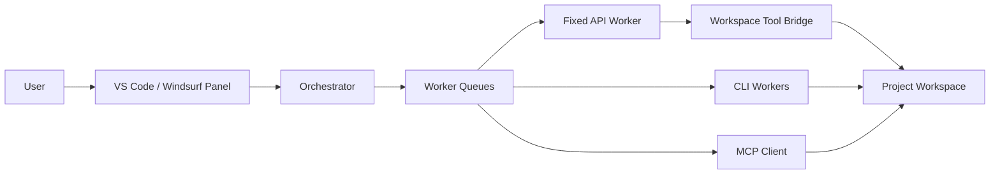

# OrchDev AI

English | [简体中文](README.md)


OrchDev AI is a local development orchestration extension for VS Code and Windsurf. It turns complex engineering work into sessions, tasks, and worker queues, then dispatches those tasks to a fixed API provider, Codex, Claude Code, Gemini, Aider, OpenCode, or an MCP client.

This is not just a chat panel. The fixed API worker includes a workspace tool bridge that can read, search, and modify project files, then reports changed files, logs, artifacts, and recovery hints back to the task view.

## Download

You can download the extension from GitHub Releases or build it locally from source.

- Latest release: [GitHub Releases](https://github.com/bebetobebe/orchdev-ai/releases/latest)
- Direct VSIX download: [orchdev-ai-0.0.2.vsix](https://github.com/bebetobebe/orchdev-ai/releases/latest/download/orchdev-ai-0.0.2.vsix)
- Local build: run `npm run vsix`, then install the generated `orchdev-ai-0.0.2.vsix`

## Community

- QQ group: `1058933735`

## Quick Start

1. Install the VSIX.
2. Open a project folder in VS Code or Windsurf.
3. Open the command palette and run `OrchDev AI：打开编排面板`.
4. Click `启用固定 API`. The default packaged provider is MintAPI, using `gpt-5.5` over the Responses API.
5. Click `测试固定 API`, and confirm the card shows both tool calling and writable execution as available.
6. Click `安全自检` to verify the read/write path. The self-check writes only `.ai-orchestrator/self-check.md`.
7. Enter a task such as “Analyze this project and fix the unresponsive button”, then click `执行`.

If your MintAPI gateway requires a key, run `OrchDev AI：设置固定 API 密钥`. The key is stored in VS Code SecretStorage, not in source code or `settings.json`.

## What It Is For

- Codebase analysis: understand structure, important modules, and risks quickly.
- Implementation planning: split large work into executable tasks with retained session context.
- Real code changes: modify project files through the fixed API workspace bridge or CLI workers.
- Multi-worker orchestration: assign different tasks to different tools instead of blocking on one tool.
- Safety checks: verify that writes are constrained to the expected workspace paths.
- Local distribution: package a VSIX for VS Code or Windsurf.

## Core Capabilities

| Area | Capability |
| --- | --- |
| Sessions | Create, select, edit, delete, summarize, and export Markdown records |
| Tasks | Ask, plan, execute, dispatch, auto-dispatch, cancel, retry, copy, and delete |
| Scheduling | Per-worker queues, idle-first dispatch, shortest-queue fallback, auto-chaining, auto-reconnect |
| Fixed API | MintAPI `gpt-5.5`, Responses API, tool-call probing, workspace read/write |
| CLI workers | Codex, OpenCode, Claude Code, Gemini, Aider |
| MCP | Placeholder MCP worker disabled by default; real MCP client can call a configured stdio tool |
| Safety | Sensitive-path blocking, read/write mode separation, local commands disabled by default, keys in SecretStorage |
| Recovery | Chinese recovery hints for quota, auth, network, overload, tool-limit, truncation, and other interruptions |

## Worker Matrix

| Worker | Read Project | Write Project | Run Commands | Notes |
| --- | --- | --- | --- | --- |
| Fixed API | Yes | Yes in Execute mode | Disabled by default | Uses OpenAI-compatible tool calls through the workspace bridge |
| HTTP relay | Optional | Optional | Disabled by default | Disabled in the self-hosted open-source profile until configured |
| Codex | Depends on CLI | Depends on CLI sandbox | Depends on CLI | Runs `codex exec` in the current workspace |
| Claude Code | Depends on CLI | Depends on CLI | Depends on CLI | Runs `claude -p` in the current workspace |
| Gemini | Depends on CLI | Depends on CLI | Depends on CLI | Runs `gemini -p` in the current workspace |
| Aider | Yes | Yes | Depends on Aider | Good fit for real file edits and diff-based workflows |
| MCP client | Depends on server | Depends on server | Depends on server | Capabilities are defined by the connected MCP server |

## Fixed API Configuration

The packaged fixed API configuration lives in [src/config/fixedApiConfig.ts](src/config/fixedApiConfig.ts). The default provider is MintAPI:

```ts
export const FIXED_API_CONFIG = {
  enabled: true,
  name: 'MintAPI',
  baseUrl: 'https://mintapi.cn/v1',
  wireApi: 'responses',
  model: 'gpt-5.5',
  reasoningEffort: 'high',
  disableResponseStorage: true,
  modelContextWindow: 400_000,
  modelAutoCompactTokenLimit: 350_000,
  systemPrompt: '',
  timeoutMs: 120_000,
  enableWorkspaceTools: true,
  allowCommandExecution: false,
  maxToolIterations: 20,
  apiKeyOptional: true,
};
```

Important fields:

- `baseUrl`: OpenAI-compatible base URL, currently `https://mintapi.cn/v1`.
- `wireApi`: request protocol, either `responses` or `chat_completions`.
- `model`: fixed model, currently `gpt-5.5`.
- `reasoningEffort`: reasoning effort for Responses API models.
- `disableResponseStorage`: sends `store: false` for Responses API requests.
- `enableWorkspaceTools`: allows file listing, search, reading, and writing inside the workspace.
- `allowCommandExecution`: controls whether the model may run local commands. It is disabled by default.
- `apiKeyOptional`: keep `true` if the service does not require a key; set `false` and save a key through the command if needed.

## Workspace Tool Boundary

The fixed API worker enables the workspace tool bridge by default. The bridge supports:

- List files
- Search text
- Read one file
- Read multiple files
- Write files
- Replace text
- Replace by line range
- Delete by line range
- Optionally run commands

Default safety policy:

- `Ask` and `Plan` expose read-only tools.
- `Execute` is required for file writes.
- `.env`, `.git`, `node_modules`, build caches, keys, certificates, and common credential files are blocked by default.
- `.ai-orchestrator/` is the safe output directory. The self-check writes only `.ai-orchestrator/self-check.md`.
- Local command execution is disabled unless `allowCommandExecution` is explicitly enabled.

## Architecture



The orchestrator owns sessions, tasks, states, queues, and recovery policy. Actual project reads and writes are performed by the fixed API tool bridge, CLI workers, or MCP services.

## Installation

### From Release

1. Open [GitHub Releases](https://github.com/bebetobebe/orchdev-ai/releases/latest).
2. Download `orchdev-ai-0.0.2.vsix`.
3. In VS Code or Windsurf, choose `Install from VSIX...` from the Extensions view.
4. Run `OrchDev AI：打开编排面板`.

### From Source

```bash
npm install
npm run verify
npm run vsix
code --install-extension orchdev-ai-0.0.2.vsix
```

Windsurf also supports VSIX installation. If the `code` command is unavailable, run `Shell Command: Install 'code' command in PATH` from the VS Code command palette.

### Installation Troubleshooting

- If you previously installed the legacy `AI 开发编排` package, uninstall it before installing `OrchDev AI`.
- Keeping both packages installed can make the legacy commands and views compete with the new build, which may look like dead buttons, failed session creation, or mismatched UI state.
- If the panel still behaves oddly, verify that the installed file is `orchdev-ai-0.0.2.vsix` instead of an older `0.0.1` build.

## Commands

| Command | Purpose |
| --- | --- |
| `OrchDev AI：打开编排面板` | Open the main panel |
| `OrchDev AI：新建会话` | Create a session |
| `OrchDev AI：新建任务` | Create a task in the current session |
| `OrchDev AI：启用固定 API` | Register the fixed API worker from source configuration |
| `OrchDev AI：设置固定 API 密钥` | Save the fixed API key |
| `OrchDev AI：测试固定 API 连接` | Test basic response and tool-call capability |
| `OrchDev AI：创建安全自检任务` | Create a self-check task that writes only `.ai-orchestrator/self-check.md` |
| `OrchDev AI：刷新视图` | Refresh the sidebar views |

## Configure Other Workers

All optional workers are disabled by default.

```jsonc
// Codex
"aiDevOrchestrator.codex.enabled": true,
"aiDevOrchestrator.codex.cliPath": "codex",
"aiDevOrchestrator.codex.sandbox": "workspace-write"

// Claude Code
"aiDevOrchestrator.claude.enabled": true,
"aiDevOrchestrator.claude.cliPath": "claude"

// Gemini
"aiDevOrchestrator.gemini.enabled": true,
"aiDevOrchestrator.gemini.cliPath": "gemini"

// Aider
"aiDevOrchestrator.aider.enabled": true,
"aiDevOrchestrator.aider.cliPath": "aider",
"aiDevOrchestrator.aider.autoConfirm": true

// MCP client
"aiDevOrchestrator.mcpClient.enabled": true,
"aiDevOrchestrator.mcpClient.command": "npx",
"aiDevOrchestrator.mcpClient.args": ["-y", "@example/my-mcp-server"],
"aiDevOrchestrator.mcpClient.toolName": "run_task",
"aiDevOrchestrator.mcpClient.promptArgName": "prompt"
```

## Development

```bash
npm install
npm run typecheck
npm run lint
npm run test:unit
npm run verify
npm run vsix
```

`npm run verify` runs type checking, production bundling, unit tests, and bundle smoke checks.

Current verification status:

- 15 test files
- 469 unit tests
- Production build passing
- Bundle smoke passing

## Documentation

- [Documentation Index](docs/README.md)
- [Open Source Release Notes](docs/OPEN_SOURCE_RELEASE.md)
- [Release Checklist](docs/RELEASE_CHECKLIST.md)
- [Architecture](docs/ARCHITECTURE.md)
- [Interruption Recovery](docs/INTERRUPTION_RECOVERY.md)
- [Security Policy](docs/SECURITY.md)
- [Contributing Guide](docs/CONTRIBUTING.md)
- [Third Party Notices](THIRD_PARTY_NOTICES.md)

## Roadmap

- Richer execution-result comparison views.
- More fixed API provider templates.
- Optional GitHub Release packaging automation.
- Finer-grained workspace tool permissions.
- Remote relay deployment guide for team use.

## License

MIT. See [LICENSE](LICENSE).
