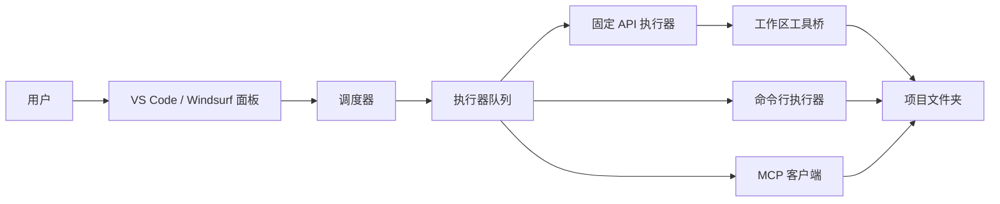

# OrchDev AI

[English](README.en.md) | 简体中文


OrchDev AI 是一个面向 VS Code 和 Windsurf 的本地开发编排扩展。它把复杂开发工作拆成会话、任务和执行器队列，再交给固定 API、Codex、Claude Code、Gemini、Aider、OpenCode 或 MCP 客户端协同处理。

它不是一个只会“聊天”的面板。固定 API 执行器内置工作区工具桥，可以读取、搜索、修改项目文件，并在任务结果中展示修改文件、日志、产物和恢复建议。

## 下载

安装包可以从 GitHub Release 下载，也可以从源码本地打包。

- 最新版本：[GitHub Releases](https://github.com/bebetobebe/orchdev-ai/releases/latest)
- 直接下载 VSIX：[orchdev-ai-0.0.1.vsix](https://github.com/bebetobebe/orchdev-ai/releases/latest/download/orchdev-ai-0.0.1.vsix)
- 本地构建：运行 `npm run vsix` 后安装生成的 `orchdev-ai-0.0.1.vsix`

## 交流群

- QQ 群：`1058933735`

## 快速开始

1. 安装 VSIX。
2. 在 VS Code 或 Windsurf 中打开一个项目文件夹。
3. 打开命令面板，运行 `OrchDev AI：打开编排面板`。
4. 点击 `启用固定 API`。当前默认固定到 MintAPI，模型为 `gpt-5.5`，请求协议为 Responses API。
5. 点击 `测试固定 API`，确认卡片显示 `工具调用已通过` 和 `执行可写`。
6. 点击 `安全自检`，验证读取项目和写入 `.ai-orchestrator/self-check.md` 的链路。
7. 在顶部输入任务，例如“分析这个项目并修复按钮点击无响应的问题”，点击 `执行`。

如果你的 MintAPI 网关需要密钥，运行 `OrchDev AI：设置固定 API 密钥`。密钥只保存到 VS Code 系统密钥存储，不写入源码和 `settings.json`。

## 适合什么场景

- 代码库分析：快速理解项目结构、关键模块和潜在风险。
- 实现规划：把一个大需求拆成可执行任务，并保留会话上下文。
- 真实改代码：通过固定 API 工作区工具桥或命令行执行器修改项目文件。
- 多执行器协作：把不同任务派给不同执行器，避免一个工具卡住整个流程。
- 安全验证：通过安全自检确认模型只写入允许目录。
- 本地自用发行：打包成 VSIX 在 VS Code 或 Windsurf 中安装。

## 核心能力

| 模块 | 能力 |
| --- | --- |
| 会话 | 新建、选择、编辑、删除、摘要、导出 Markdown |
| 任务 | 提问、规划、执行、派发、自动派发、取消、重试、复制、删除 |
| 调度 | 每个执行器独立队列、空闲优先、队列最短优先、自动接续、自动重连 |
| 固定 API | MintAPI `gpt-5.5`、Responses API、工具调用测试、工作区读写 |
| 命令行执行器 | Codex、OpenCode、Claude Code、Gemini、Aider |
| MCP | 内置占位执行器默认关闭，真实 MCP 客户端可通过 stdio 调用指定工具 |
| 安全 | 敏感路径拦截、只读/写入模式隔离、命令执行默认关闭、密钥进系统密钥存储 |
| 恢复 | 额度、授权、网络、服务过载、工具调用上限、回复截断等中文恢复建议 |

## 执行器能力矩阵

| 执行器 | 读项目 | 写项目 | 运行命令 | 说明 |
| --- | --- | --- | --- | --- |
| 固定 API | 支持 | 执行模式支持 | 默认关闭 | 通过 OpenAI 工具调用桥读写工作区 |
| HTTP 中继服务 | 可选 | 可选 | 默认关闭 | 开源自用版默认关闭，需要先配置中继地址 |
| Codex | 取决于 CLI | 取决于 CLI 沙箱 | 取决于 CLI | 在当前工作区运行 `codex exec` |
| Claude Code | 取决于 CLI | 取决于 CLI | 取决于 CLI | 在当前工作区运行 `claude -p` |
| Gemini | 取决于 CLI | 取决于 CLI | 取决于 CLI | 在当前工作区运行 `gemini -p` |
| Aider | 支持 | 支持 | 取决于 Aider | 适合真实文件编辑和 diff 工作流 |
| MCP 客户端 | 取决于服务 | 取决于服务 | 取决于服务 | 能力由你连接的 MCP 服务决定 |

## 固定 API 配置

固定 API 的打包配置位于 [src/config/fixedApiConfig.ts](src/config/fixedApiConfig.ts)。当前默认配置为 MintAPI：

```ts
export const FIXED_API_CONFIG = {
  enabled: true,
  name: 'MintAPI',
  baseUrl: 'https://mintapi.cn/v1',
  wireApi: 'responses',
  model: 'gpt-5.5',
  reasoningEffort: 'high',
  disableResponseStorage: true,
  modelContextWindow: 2_000_000,
  modelAutoCompactTokenLimit: 2_000_000,
  systemPrompt: '',
  timeoutMs: 120_000,
  enableWorkspaceTools: true,
  allowCommandExecution: false,
  maxToolIterations: 20,
  apiKeyOptional: true,
};
```

关键字段：

- `baseUrl`：OpenAI 兼容基础地址，当前为 `https://mintapi.cn/v1`。
- `wireApi`：请求协议，支持 `responses` 和 `chat_completions`。
- `model`：固定模型，当前为 `gpt-5.5`。
- `reasoningEffort`：Responses API 模型的推理强度。
- `disableResponseStorage`：Responses API 下发送 `store: false`。
- `enableWorkspaceTools`：允许读取、搜索和写入工作区文件。
- `allowCommandExecution`：是否允许模型运行本地命令，默认关闭。
- `apiKeyOptional`：服务无需密钥时保持 `true`；如果需要密钥，改为 `false` 并通过命令保存密钥。

## 工作区工具边界

固定 API 执行器默认启用工作区工具桥。工具桥支持：

- 列出文件
- 搜索文本
- 读取单个文件
- 一次读取多个文件
- 写入文件
- 文本替换
- 按行号替换
- 按行号删除
- 可选运行命令

默认安全策略：

- `Ask` 和 `Plan` 模式只暴露只读工具。
- `Execute` 模式才允许写文件。
- 默认拒绝 `.env`、`.git`、`node_modules`、构建缓存、密钥、证书等敏感路径。
- `.ai-orchestrator/` 是安全输出目录，安全自检只会写入 `.ai-orchestrator/self-check.md`。
- 本地命令执行默认关闭，只有显式打开 `allowCommandExecution` 才会暴露命令工具。

## 架构



调度器只负责会话、任务、状态、队列和恢复策略。真正的代码读写由固定 API 工具桥、命令行执行器或 MCP 服务完成。

## 安装方式

### 从 Release 安装

1. 打开 [GitHub Releases](https://github.com/bebetobebe/orchdev-ai/releases/latest)。
2. 下载 `orchdev-ai-0.0.1.vsix`。
3. 在 VS Code 或 Windsurf 的扩展面板选择 `Install from VSIX...`。
4. 安装后运行 `OrchDev AI：打开编排面板`。

### 从源码打包

```bash
npm install
npm run verify
npm run vsix
code --install-extension orchdev-ai-0.0.1.vsix
```

Windsurf 同样支持从 VSIX 安装。如果终端没有 `code` 命令，可以在 VS Code 命令面板运行 `Shell Command: Install 'code' command in PATH`。

## 常用命令

| 命令 | 用途 |
| --- | --- |
| `OrchDev AI：打开编排面板` | 打开主面板 |
| `OrchDev AI：新建会话` | 创建会话 |
| `OrchDev AI：新建任务` | 为当前会话创建任务 |
| `OrchDev AI：启用固定 API` | 按源码固定配置注册固定 API |
| `OrchDev AI：设置固定 API 密钥` | 保存固定 API 密钥 |
| `OrchDev AI：测试固定 API 连接` | 测试基础响应和工具调用能力 |
| `OrchDev AI：创建安全自检任务` | 只写入 `.ai-orchestrator/self-check.md` 的验证任务 |
| `OrchDev AI：刷新视图` | 刷新侧边栏会话和任务 |

## 配置其它执行器

所有执行器默认关闭，需要按需启用。

```jsonc
// Codex
"aiDevOrchestrator.codex.enabled": true,
"aiDevOrchestrator.codex.cliPath": "codex",
"aiDevOrchestrator.codex.sandbox": "workspace-write"

// Claude Code
"aiDevOrchestrator.claude.enabled": true,
"aiDevOrchestrator.claude.cliPath": "claude"

// Gemini
"aiDevOrchestrator.gemini.enabled": true,
"aiDevOrchestrator.gemini.cliPath": "gemini"

// Aider
"aiDevOrchestrator.aider.enabled": true,
"aiDevOrchestrator.aider.cliPath": "aider",
"aiDevOrchestrator.aider.autoConfirm": true

// MCP 客户端
"aiDevOrchestrator.mcpClient.enabled": true,
"aiDevOrchestrator.mcpClient.command": "npx",
"aiDevOrchestrator.mcpClient.args": ["-y", "@example/my-mcp-server"],
"aiDevOrchestrator.mcpClient.toolName": "run_task",
"aiDevOrchestrator.mcpClient.promptArgName": "prompt"
```

## 开发

```bash
npm install
npm run typecheck
npm run lint
npm run test:unit
npm run verify
npm run vsix
```

`npm run verify` 会依次完成类型检查、生产打包、单元测试和打包烟测。

当前验证状态：

- 15 个测试文件
- 469 个单元测试
- 生产构建通过
- bundle smoke 通过

## 文档

- [文档索引](docs/README.md)
- [开源发布说明](docs/OPEN_SOURCE_RELEASE.md)
- [发布检查清单](docs/RELEASE_CHECKLIST.md)
- [架构说明](docs/ARCHITECTURE.md)
- [中断恢复说明](docs/INTERRUPTION_RECOVERY.md)
- [安全策略](docs/SECURITY.md)
- [贡献指南](docs/CONTRIBUTING.md)
- [第三方许可证](THIRD_PARTY_NOTICES.md)

## 路线图

- 更完整的执行结果对比视图。
- 更多固定 API provider 模板。
- 可选的 Release 自动打包流程。
- 更细粒度的工作区工具权限配置。
- 面向团队使用的远程中继部署指南。

## 许可证

MIT。详见 [LICENSE](LICENSE)。
