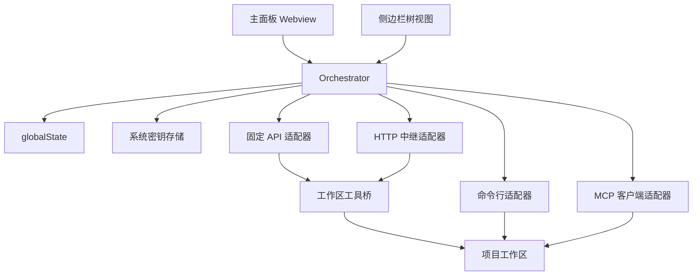

# 架构说明

## 1. 总体结构

系统运行在 VS Code 扩展宿主进程中，由四层组成：

- 展示层：主面板 Webview 与侧边栏树视图。
- 应用层：`Orchestrator` 单例，维护会话、任务、执行器和队列。
- 适配层：不同执行器适配器，统一实现 `IWorkerAdapter`。
- 持久化层：通过 `globalState` 保存状态，通过系统密钥存储保存令牌和密钥。



## 2. 展示层

### 主面板

- 渲染会话列表、任务列表、执行器状态面板。
- 支持任务搜索、状态筛选、自动接续开关。
- 支持会话和待处理任务的行内编辑。
- 提供提问、规划、执行、预设提示词和固定 API 直达入口。
- 展示任务结果、修改文件、产物、日志和流式输出。
- 展示执行器能力标签，例如可读项目、执行可写、本地命令、仅文本响应。

### 侧边栏

- 会话树：快速切换当前会话。
- 任务树：查看当前会话任务概览。
- 欢迎区提供打开面板、启用固定 API、测试固定 API 和安全自检入口。

## 3. 应用层

`Orchestrator` 是全局唯一状态源，职责包括：

- 新建、编辑、删除会话与任务。
- 调度任务到指定执行器。
- 自动选择可用执行器。
- 维护每个执行器的 FIFO 队列。
- 处理取消、重试、批量取消、批量重试。
- 控制自动派发和自动接续。
- 识别常见执行中断，生成恢复提示，并对临时性错误安排延迟自动重试。
- 汇总并向界面广播状态变化。

## 4. 调度模型

### 状态流转

```text
待处理 -> 运行中 -> 已完成
待处理 -> 运行中 -> 失败
待处理 -> 运行中 -> 已取消
待处理 -> 排队中 -> 运行中
失败 / 已取消 -> 重试 -> 待处理
运行中 -> 临时中断 -> 排队中（等待自动重试） -> 运行中
```

### 队列策略

- 每个执行器一个 FIFO 队列。
- 执行器空闲时直接执行。
- 执行器忙碌时任务进入对应队列。
- 执行器断开时拒绝派发，任务保持待处理。
- 自动派发优先找空闲执行器；没有空闲时选择队列最短者。
- 对请求过快、网络异常、服务过载和服务内部错误，调度器会在配置允许时释放执行器、等待一段时间，再重新执行原任务。
- 对额度耗尽、授权失败、版本过旧、回复截断、工具调用上限和命令卡住，调度器只给出恢复建议，不盲目自动重试。

## 5. 执行器适配层

当前主要分为四类：

- 固定 API 执行器：打包时固定 OpenAI 兼容地址、模型和请求协议，默认使用 MintAPI `gpt-5.5` 与 Responses API。
- 命令行执行器：Codex、OpenCode、Claude Code、Gemini、Aider。
- MCP 执行器：占位 MCP 与真实 MCP 客户端。
- HTTP 中继执行器：内置中继服务，开源自用版默认关闭。

共同点：

- 都向调度器暴露统一连接、断开、执行、取消接口。
- 调度器控制状态流转，执行器负责具体调用。
- 执行器可声明能力标签，帮助用户判断是否能读项目、写项目或运行命令。

差异点：

- 固定 API 与 HTTP 中继可以启用工作区工具桥，通过 OpenAI 兼容工具调用读写项目文件。
- 命令行执行器在工作区内启动子进程，实际读写能力由各自 CLI 的登录状态、沙箱和模型决定。
- MCP 客户端执行器通过 stdio 调用 MCP 服务的指定工具，能力由连接的 MCP 服务决定。

## 6. 工作区工具桥

固定 API 默认启用工作区工具桥。工具桥在 `Ask` / `Plan` 模式下只读，在 `Execute` 模式下才允许写入。

内置工具包括：

- 列出文件
- 搜索文本
- 读取单个文件
- 批量读取文件
- 写入文件
- 文本替换
- 按行范围替换
- 按行范围删除
- 可选运行命令

安全策略：

- 默认拒绝访问 `.env`、`.git`、`node_modules`、构建缓存和常见密钥/证书文件。
- 默认允许安全自检写入 `.ai-orchestrator/self-check.md`。
- 本地命令执行默认关闭，需要显式开启 `allowCommandExecution`。

## 7. 流式输出与产物

- 支持流式输出的执行器会把增量内容写入 `streamingOutput`。
- Webview 以节流方式刷新，避免高频消息淹没界面。
- 输出中的 Markdown 代码块和 `diff --git` 内容会被解析为结构化产物。
- 固定 API 工具桥会记录已修改文件，并在任务结果中显示可点击入口。

## 8. 持久化与密钥

- 会话和任务状态保存在 `globalState`。
- 中继服务令牌与固定 API 密钥保存在 VS Code 系统密钥存储。
- 已废弃的明文令牌配置会在启动时自动迁移。

## 9. Windsurf 兼容说明

扩展通过标准 VS Code 扩展机制和 VSIX 安装方式在 Windsurf 中运行。项目没有实现 Windsurf/Cascade 私有工具协议；真实开发能力来自：

- 固定 API 的工作区工具桥
- Codex、Claude Code、Gemini、Aider、OpenCode 等命令行执行器
- MCP 客户端连接的外部工具服务
